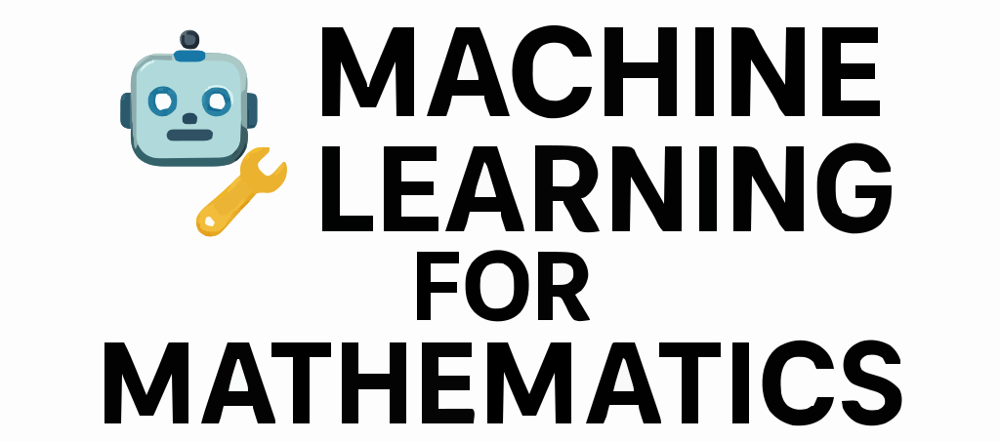

  
  
  
  

> **Machine Learning for Mathematics** is a guided code-based learning journey.  It is built to bridge the gap between theory and implementation in machine learning mathematics — covering **Linear Algebra, Calculus, Optimization, and Probability** with real code.

## 📚 Table of Contents

- [📚 Table of Contents](#-table-of-contents)
- [📚 Overview](#-overview)
- [📂 Repository Structure](#-repository-structure)
- [📜 License](#-license)

---

## 📚 Overview

This repository contains a chapter-wise codebase for understanding **Mathematics for Machine Learning**, covering key areas:

- Linear Algebra 🧮  
- Calculus 🔢  
- Optimization 📉  
- Probability & Statistics 🎲  

Each concept is paired with real-world code in Python using NumPy and other essential libraries.

---

## 📂 Repository Structure

Each folder corresponds to a chapter, named simply and cleanly.

| 🔢 Chapter | 📘 Topic                                       | 📁 Folder Name              |
|------------|------------------------------------------------|-----------------------------|
| 01         | Vectors and Vector Spaces                      | `01-vectors/`               |
| 02         | Geometric Structure of Vector Spaces           | `02-geometry/`              |
| 03         | Linear Algebra in Practice                     | `03-linear-algebra/`        |
| 04         | Linear Transformations                         | `04-transformations/`       |
| 05         | Matrices and Equations                         | `05-equations/`             |
| 06         | Eigenvalues and Eigenvectors                   | `06-eigen/`                 |
| 07         | Matrix Factorizations                          | `07-factorizations/`        |
| 08         | Matrices and Graphs                            | `08-graphs/`                |
| 09         | Functions                                      | `09-functions/`             |
| 10         | Numbers, Sequences, and Series                 | `10-sequences/`             |
| 11         | Topology, Limits, and Continuity               | `11-topology/`              |
| 12         | Differentiation                                | `12-differentiation/`       |
| 13         | Optimization (Single Variable)                 | `13-optimization/`          |
| 14         | Integration                                    | `14-integration/`           |
| 15         | Multivariable Functions                        | `15-multivariable/`         |
| 16         | Derivatives and Gradients                      | `16-gradients/`             |
| 17         | Optimization in Multiple Variables             | `17-optimization-multi/`    |
| 18         | What is Probability?                           | `18-probability/`           |
| 19         | Random Variables and Distributions             | `19-random/`                |
| 20         | Expected Value, Variance & Entropy             | `20-expected-value/`        |

---

## 📜 License

This project is licensed under the **MIT License**.  
See the [LICENSE](LICENSE) file for details.

---

> ⭐ If this project helps you, consider giving it a **star** — your support matters!

